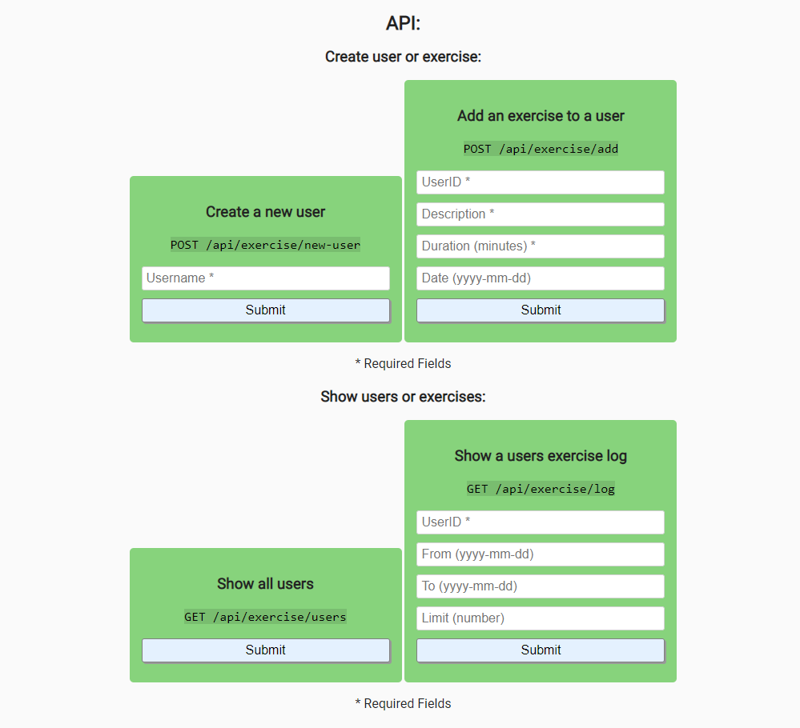

# Exercise Tracker

## Introduction
An exercise tracker that keeps track of users and lets them add exercise sessions or retrieve any amount of sessions for specific time frames.

This project is part of freeCodeCamps API And Microservices certificate.

***

## Project Requirements
* A user can be created by posting form data username to /api/exercise/new-user and returned will be an object with username and _id.
* An array of all users can be retrieved by getting api/exercise/users with the same info as when creating a user.
* An exercise can be added to any user by posting form data userId(_id), description, duration, and optionally date to /api/exercise/add. If no date supplied it will use current date. Returned will the the user object with also with the exercise fields added.
* A full exercise log of any user can be retrived by getting /api/exercise/log with a parameter of userId(_id). Return will be the user object with added array log and count (total exercise count).
* Part of the log of any user can be retrieved by also passing along optional parameters of from & to or limit. (Date format yyyy-mm-dd, limit = int)

***

## Final Project
https://fcc-api-exercise-tracker-fred.glitch.me

***

## Behind the scenes
### Backend:
* Node
* Express
* Mongoose

### Database:
* MongoDB

### Hosting:
* Glitch
* mLab

***

## Preview Images
### Main Screen:

